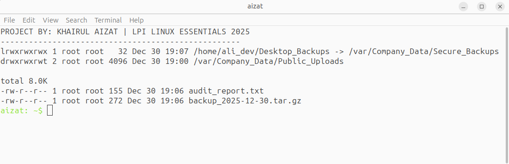
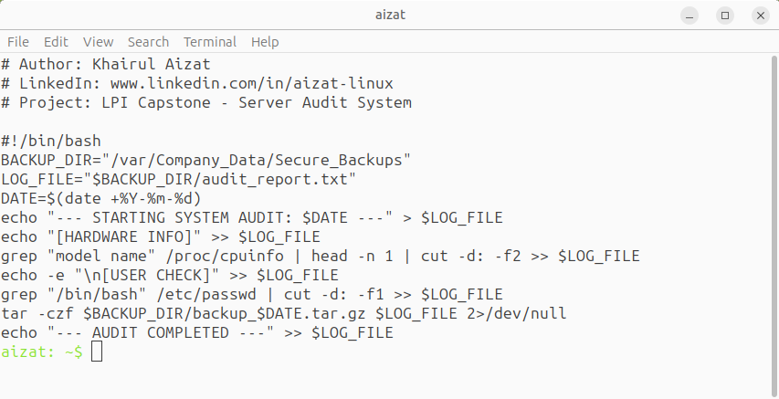

# Linux Server Provisioning & Audit System

> **LPI Linux Essentials (010-160) Capstone Project** — A complete Bash automation pipeline integrating user provisioning, hardware auditing, and secure log archival on Ubuntu Server.

---

## 📋 Project Overview

This capstone project consolidates every core Linux administration concept from the LPI Linux Essentials curriculum into a **production-style audit and provisioning workflow**. The system simulates a real-world scenario where a SysAdmin must:

1. Onboard a new developer with appropriate group membership and least-privilege access
2. Establish a secure shared upload directory protected against accidental data loss
3. Generate automated hardware and user audit reports
4. Archive audit logs efficiently for long-term retention
5. Provide quick-access symbolic links for operational efficiency

---

## 🎯 Skills Demonstrated

| Domain | Concepts Applied |
|--------|------------------|
| User & Group Management | useradd, groupadd, home directory provisioning, /etc/skel |
| File Permissions & Security | Sticky Bit (1777), Read/Execute (750), least privilege |
| Bash Scripting | Shebang, variables, command substitution, I/O redirection |
| Text Processing | grep, cut, pipes, header extraction from /proc/cpuinfo |
| Archiving & Compression | tar with gzip for efficient log retention |
| File System Efficiency | Symbolic links (ln -s) for shared resource access |
| System Auditing | Live hardware introspection, user enumeration via /etc/passwd |

---

## 🛠️ Environment

- **OS:** Ubuntu Server 24.04 LTS
- **Hypervisor:** Oracle VirtualBox
- **Shell:** Bash 5.x
- **Required Privileges:** sudo / root for directory creation and ownership

---

## 📜 The Audit Script

    #!/bin/bash
    # Author: Khairul Aizat
    # LinkedIn: www.linkedin.com/in/aizat-linux
    # Project: LPI Capstone - Server Audit System

    BACKUP_DIR="/var/Company_Data/Secure_Backups"
    LOG_FILE="$BACKUP_DIR/audit_report.txt"
    DATE=$(date +%Y-%m-%d)

    echo "--- STARTING SYSTEM AUDIT: $DATE ---" > $LOG_FILE
    echo "[HARDWARE INFO]" >> $LOG_FILE
    grep "model name" /proc/cpuinfo | head -n 1 | cut -d: -f2 >> $LOG_FILE

    echo -e "\n[USER CHECK]" >> $LOG_FILE
    grep "/bin/bash" /etc/passwd | cut -d: -f1 >> $LOG_FILE

    tar -czf $BACKUP_DIR/backup_$DATE.tar.gz $LOG_FILE 2>/dev/null
    echo "--- AUDIT COMPLETED ---" >> $LOG_FILE

### Script Breakdown

| Line | Purpose |
|------|---------|
| BACKUP_DIR=... | Centralizes backup location for maintainability |
| DATE=$(date +%Y-%m-%d) | Generates date stamp for unique archive naming |
| grep "model name" /proc/cpuinfo | Extracts CPU model from kernel-exposed hardware info |
| head -n 1 | Limits output to a single line (prevents duplicates on multi-core systems) |
| cut -d: -f2 | Strips the field label, keeps only the value |
| >> $LOG_FILE | Appends to log without overwriting prior entries |
| tar -czf ... 2>/dev/null | Creates gzipped archive, suppresses stderr noise |

---

## ⚙️ Execution Workflow

### 1. Provision Developer Environment

    sudo groupadd developers
    sudo useradd -m -G developers ali_dev

### 2. Create Secure Directory Structure

    sudo mkdir -p /var/Company_Data/Public_Uploads
    sudo mkdir -p /var/Company_Data/Secure_Backups
    sudo chmod 1777 /var/Company_Data/Public_Uploads
    sudo chmod 750  /var/Company_Data/Secure_Backups

### 3. Create Symbolic Link

    sudo ln -s /var/Company_Data/Secure_Backups /home/ali_dev/Desktop_Backups

### 4. Run the Audit Script

    sudo bash audit.sh

---

## ✅ Verification Output

    PROJECT BY: KHAIRUL AIZAT | LPI LINUX ESSENTIALS 2025
    -----------------------------------------------------
    lrwxrwxrwx 1 root root   32 Dec 30 19:07 /home/ali_dev/Desktop_Backups -> /var/Company_Data/Secure_Backups
    drwxrwxrwt 2 root root 4096 Dec 30 19:00 /var/Company_Data/Public_Uploads

    total 8.0K
    -rw-r--r-- 1 root root 155 Dec 30 19:06 audit_report.txt
    -rw-r--r-- 1 root root 272 Dec 30 19:06 backup_2025-12-30.tar.gz

**Confirmed indicators:**

- `lrwxrwxrwx` — Symbolic link successfully created
- `drwxrwxrwt` — Sticky bit (t) applied to public upload directory
- `audit_report.txt` — Generated by the script
- `backup_2025-12-30.tar.gz` — Compressed archive created with date-stamped naming

---

## 📸 Proof of Execution

### Terminal Output

The verification output confirms successful execution — symbolic link creation (`lrwxrwxrwx`), sticky bit application (`drwxrwxrwt`), audit report generation, and gzipped archive creation.

### Bash Script Reference

> 📄 **Full script available:** [`audit.sh`](audit.sh)

---

## 💡 Lessons Learned

- **Least privilege isn't optional.** Applying 750 on backup directories prevents non-owners from even listing contents — a foundational defense layer.
- **The Sticky Bit solves a real problem.** Without it, any user could delete another user's uploads in a shared 1777 directory.
- **/proc/cpuinfo is a goldmine.** Linux exposes live hardware state through the proc filesystem — no external tools required.
- **2>/dev/null keeps logs clean.** Suppressing stderr from tar prevents non-critical warnings from cluttering audit output.
- **Symbolic links are pointers, not copies.** They save disk space and keep references in sync — but break if the target is moved.

---

## 🔮 Future Improvements

- Schedule via cron for automated daily audits
- Email log summaries using mail or sendmail
- Add integrity verification using sha256sum checksums
- Migrate to systemd timer units for better reliability than cron
- Extend to multi-server audit using SSH key-based authentication

---

## 👤 Author

**Khairul Aizat**
Aspiring Cloud & Linux Operations Engineer | KL, Malaysia

- LinkedIn: [linkedin.com/in/aizat-linux](https://www.linkedin.com/in/aizat-linux)
- LPI Linux Essentials — High Distinction (750/800)
- AWS Certified Cloud Practitioner (CLF-C02)

---

> *"Discipline beats motivation. Documentation beats memory."*
